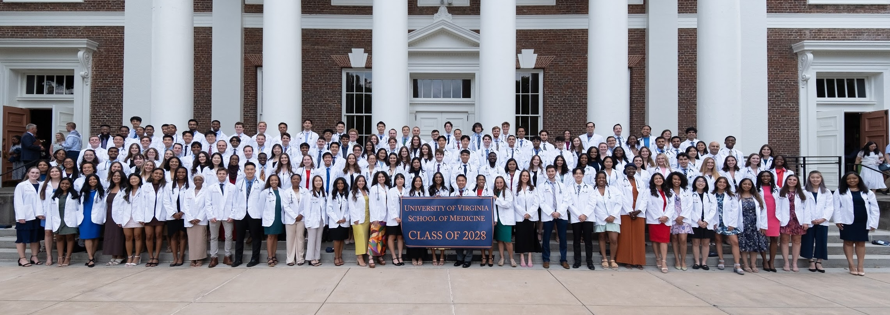

I am a first year medical student at the University of Virginia School of Medicine. I lead research on improving access and outcomes in cardiothoracic transplantation, but I’m currently transitioning away to explore research opportunities in other fields of surgery. I have experience in chart review and retrospective database research using [ACS NSQIP](https://www.facs.org/quality-programs/data-and-registries/acs-nsqip/), [CDC WONDER](https://wonder.cdc.gov/wonder/help/main.html#WhatisWONDER), [CPSC NEISS](https://www.cpsc.gov/Research--Statistics/NEISS-Injury-Data), and [UNOS OPTN STAR](https://optn.transplant.hrsa.gov/data/). Outside of research, I am involved in supporting medico-legal justice at the [Legal Aid Justice Center](https://www.justice4all.org), volunteering for Remote Area Medical, and mentoring pre-medical students. 

I graduated summa cum laude from the College of William & Mary in December 2023 with a B.S. in Neuroscience and a minor in Computational and Applied Mathematics. As an undergraduate student, I taught Organic Chemistry Lab for four semesters as a teaching assistant and was selected for a 10-week research fellowship at the [Pauley Heart Center](https://www.vcuhealth.org/pauley-heart-center/). I also led student research teams investigating neural development and helped lead over 100 volunteers for [Griffin School Partnerships](https://www.wm.edu/offices/cce/programs/education-programs/griffin-school-partnerships/), an outreach program offering tutoring and mentorship for underserved middle schoolers.

<html>
<head>
  <!-- Add the Font Awesome CSS link below -->
  <link rel="stylesheet" href="https://cdnjs.cloudflare.com/ajax/libs/font-awesome/6.5.2/css/all.min.css">
  <!-- Add any necessary meta tags, CSS, or other dependencies in the head section -->
  
</head>
<body>
  

    

      <h2>Education</h2>
      
<i class="fas fa-graduation-cap" aria-hidden="true"></i> <b>North Cross School, Salutatorian</b> <i>High School Diploma - 2020</i>

      
<i class="fas fa-graduation-cap" aria-hidden="true"></i> <b>College of William and Mary</b> <i>B.S. Neuroscience, Statistics Minor - 2023</i>

      
<i class="fas fa-graduation-cap" aria-hidden="true"></i> <b>University of Virginia School of Medicine</b> <i>Doctor of Medicine - Expected 2028</i>

    

    

      <h2>Interests</h2>
      <ul>
        <li>Research</li>
        <li>Surgical Outcomes</li>
        <li>Health Equity</li>
        <li>Education and Outreach</li>
        <li>Mentorship</li>
      </ul>
    

  

</body>
</html>

{: style="border: 7% solid rgba(138,137,127, 0.15); border-radius: 5%;"}

 
Before starting medical school, I spent six months as a [Virginia All-In Tutor](https://www.doe.virginia.gov/teaching-learning-assessment/all-in-tutoring) at Roanoke City Public Schools teaching math and science for 5th-grade students at risk of failing their standardized exams.

When I’m not engaged in research or schoolwork, I enjoy cooking, playing spikeball and frisbee golf, and listening to audiobooks.

<html>
<head>
  
</head>
<body>
  

    

      <!-- First image -->
      
      
Crim Dell Bridge, College of William and Mary

    

    

      <!-- Second image -->
      
      
The Rotunda, University of Virginia

    

  

</body>
</html>
